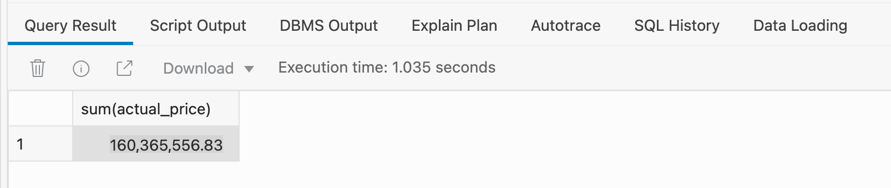
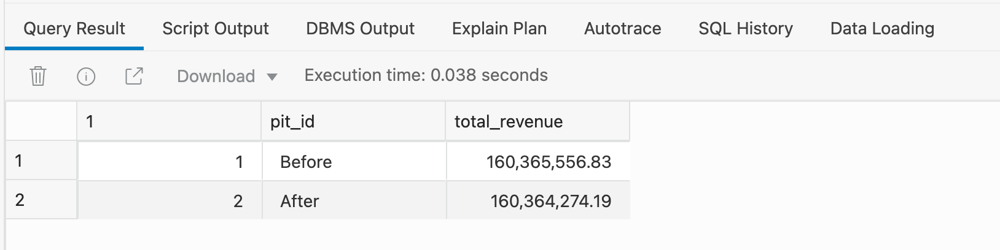


# Traveling Back In Time 

## Introduction

Autonomous Database has a built-in feature called  ***Flashback***. Flashback Query, the first Flashback feature added to Oracle Database, was introduced in Oracle 9i (2000). It provides a simple, powerful and completely non-disruptive way to query a table to view data at a previous point in time.

This allows you to view past states of database objects or to return your ADB objects to a previous state With flashback features, you can:
<ul>
<li>Perform queries that return past data</li>
<li>Recover tables or rows to a previous point in time</li>
</ul>

## What is Flashback?


Estimated Lab Time: 15 minutes

### Objectives

In this lab, you will learn how to:

*   Use flashback queries to step back in time.
*   Recover a dropped table.

### Prerequisites

This lab assumes you have:

- loaded the movie sales data and applied the country-based adjustments using the steps in previous labs which are part of this workshop.

<br><br>

## STEP 1 - Setting the Point-In-Time For Historical Queries

1. To use flashback queries we need to know the historical point-in-time that we want use. In this case it's the timestamp from before the adjustments for Argentina were processed:

    ```
    <copy>define starting_pit_adjustments = 'enter_your_timestamp_in_here_the_format_YYYY-MM-DD_HH:MI:SS';</copy>
    ```

2. The above statement should look similar to this:

    ```
    <copy>define starting_pit_adjustments = '2021-08-05 10:07:00';</copy>
    ```


## STEP 2 - A Simple Query To Show Total Revenue

1. Having applied the adjustments for Argentina we can view the new value for total revenue using this query:

    ```
    <copy>SELECT
	SUM(actual_price)
	FROM movie_sales_fact</copy>
    ```

2. This will return a value of 160,364,274.19

    

<br><br>

## STEP 3 - A Simple Flashback Query To Show Total Revenue

1. To look at total revenue before the adjustments for Argentina were applied we simply extend the previous query with the keywords **AS OF**:

    ```
    <copy>SELECT
	SUM(actual_price)
	FROM movie_sales_fact  AS OF TIMESTAMP TO_TIMESTAMP('&starting_pit_adjustments', 'YYYY-MM-DD HH24:MI:SS')</copy>
    ```

2. This will return a value of 160,364,274.19:

    


## STEP 4 - Viewing Two Different Points-In-Time

1. Now let's combine both queries using the keyword **UNION** to give a 'before' and 'after' view:

    ```
    <copy>SELECT
	1,
	'Before' AS pit_id,
	SUM(actual_price)  AS total_revenue
	FROM movie_sales_fact  AS OF TIMESTAMP TO_TIMESTAMP('&starting_pit_adjustments', 'YYYY-MM-DD HH24:MI:SS')
	UNION
	SELECT
	2,
	'After' AS pit_id,
	SUM(actual_price) AS total_revenue
	FROM movie_sales_fact;</copy>
    ```

2. TThis will return a value of 160,364,274.19:

    


## STEP 5 - Detailed View Of 'Before' And 'After'

1. Use the following query to create a more detailed report of the before and after for each row that was updated: 

    ```
    <copy>SELECT 
	f.order_num,
	a.discount_percent as adj_discount,
	f.actual_price AS original_price,
	a.actual_price AS adj_price,
	m.actual_price AS final_price
	FROM movie_sales_fact  AS OF TIMESTAMP TO_TIMESTAMP('&starting_pit_adjustments', 'YYYY-MM-DD HH24:MI:SS') f, movie_fin_adj_argentina_ext a, movie_sales_fact m
	WHERE f.order_num = a.order_num
	AND m.order_num = f.order_num
	order by 1;</copy>
    ```

2. This will return zero rows into our results window:

    

    This means that our table is not consuming any space within our database.
<br><br>


## Summary

Flashback first appeared in the Oracle Database back in 2001. 

Obviously, Autonomous Database automatically manages flashback so there are no settings to monitor or tweak. You simply work with your your data and the Autonomous Database will efficiently manage how to view historical versions of your data.


Please *proceed to the next lab*.

## **Acknowledgements**

* **Author** - Keith Laker, ADB Product Management
* **Adapted for Cloud by** - Richard Green, Principal Developer, Database User Assistance
* **Last Updated By/Date** - Keith Laker, August 2021
