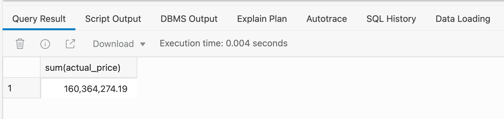
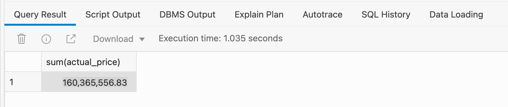
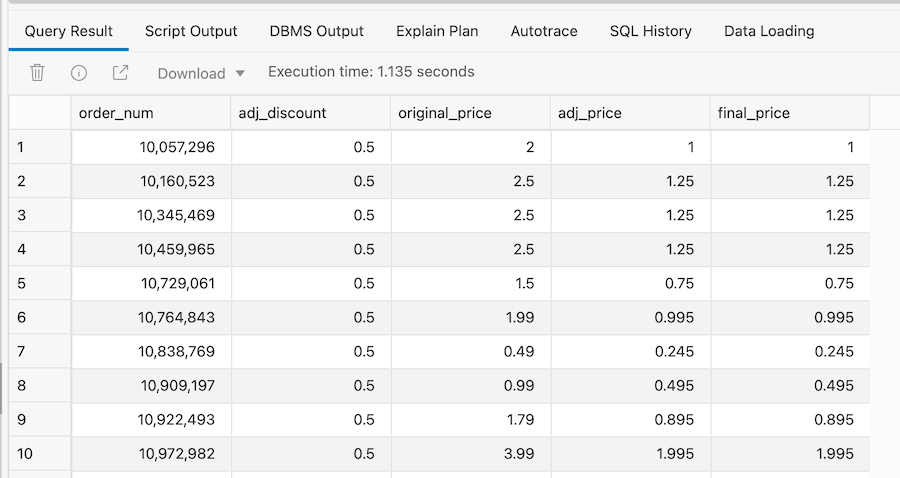
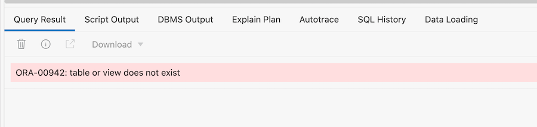
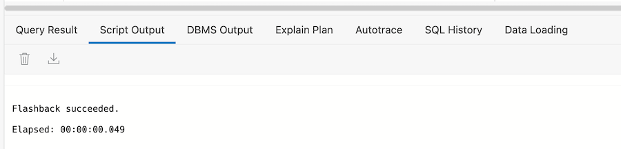
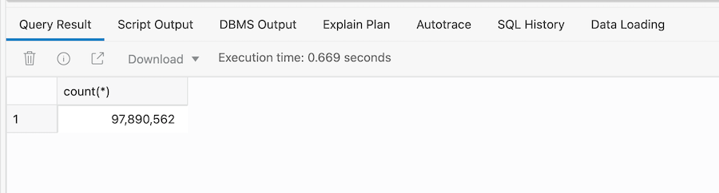


# Traveling Back In Time 

## Introduction

Autonomous Database has a built-in feature called  ***Flashback***. 
Oracle Autonomous Data Warehouse includes a smart built-in featured called **Flashback**. This can help you go back in time when you query your data. It can help you to perform faster, easier, and convenient recovery from situations where you need to quickly backout recently loaded data or simply query a dataset to understand how it has changed over time .

Flashback is not a new feature in Autonomous Data Warehouse. It was added to the Oracle Database in Oracle 9i (2001), and it is used extensively by many Oracle Database customers. 

In this lab will propvide a brief introduction to flashback queries by showing how to view past states of our movie_sales_fact table before and after processing adjustments. 

Estimated Lab Time: 15 minutes

### Objectives

In this lab, you will learn how to:

*   Use flashback queries to step back in time.
*   Recover a dropped table.

### Prerequisites

This lab assumes you have:

- loaded the movie sales data and applied the first country-based adjustment file as described in Updating the Sales Data - Part 1.

<br><br>

## STEP 1 - Setting the Point-In-Time For Historical Queries

1. To use flashback queries we need to know the historical point-in-time that we want use. In this case it's the timestamp from before the adjustments for Argentina were processed (the time you noted in step 4 of the lab Updating the Sales Data - Part 1):

    ```
    <copy>define starting_pit_adjustments = 'enter_your_timestamp_in_here_the_format_YYYY-MM-DD_HH:MI:SS';</copy>
    ```

2. The above statement should look similar to this:

    ```
    <copy>define starting_pit_adjustments = '2021-08-05 10:07:00';</copy>
    ```


## STEP 2 - A Simple Query To Show Total Revenue

1. Having applied the adjustments for Argentina we can view the new value for total revenue using this query:

    ```
    <copy>SELECT
	SUM(actual_price)
	FROM movie_sales_fact</copy>
    ```

2. This will return a value of 160,364,274.19

    

<br><br>

## STEP 3 - A Simple Flashback Query To Show Total Revenue

1. To look at total revenue before the adjustments for Argentina were applied we simply extend the previous query with the keywords **AS OF** (*note - use the data-time information from Task 4, step 1 in the previous tab)*:

    ```
    <copy>SELECT
	SUM(actual_price)
	FROM movie_sales_fact  AS OF TIMESTAMP TO_TIMESTAMP('&starting_pit_adjustments', 'YYYY-MM-DD HH24:MI:SS')</copy>
    ```

2. This will return a value of 160,364,274.19:

    


## STEP 4 - Viewing Two Different Points-In-Time

1. Now let's combine both queries using the keyword **UNION** to give a 'before' and 'after' view:

    ```
    <copy>SELECT
	1,
	'Before' AS pit_id,
	SUM(actual_price)  AS total_revenue
	FROM movie_sales_fact  AS OF TIMESTAMP TO_TIMESTAMP('&starting_pit_adjustments', 'YYYY-MM-DD HH24:MI:SS')
	UNION
	SELECT
	2,
	'After' AS pit_id,
	SUM(actual_price) AS total_revenue
	FROM movie_sales_fact;</copy>
    ```

2. TThis will return a value of 160,364,274.19:

    


## STEP 5 - Detailed View Of 'Before' And 'After'

1. Use the following query to create a more detailed report of the before and after for each row that was updated: 

    ```
    <copy>SELECT 
	f.order_num,
	a.discount_percent as adj_discount,
	f.actual_price AS original_price,
	a.actual_price AS adj_price,
	m.actual_price AS final_price
	FROM movie_sales_fact  AS OF TIMESTAMP TO_TIMESTAMP('&starting_pit_adjustments', 'YYYY-MM-DD HH24:MI:SS') f, movie_fin_adj_argentina_ext a, movie_sales_fact m
	WHERE f.order_num = a.order_num
	AND m.order_num = f.order_num
	order by 1;</copy>
    ```

2. This will return zero rows into our results window:

    

    This means that our table is not consuming any space within our database.
<br><br>

## STEP 6 - Recovering A Dropped Table

It's easily done - someone accidently drops the table which contains all your data. Fortunately, Autonomous Data Warehouse has the ability to quickly recover the table and all its data.

1. Run a simple SQL query to find the number of rows in the table movie_sales_fact:

    ```
    <copy>SELECT COUNT(*) FROM movie_sales_fact</copy>
    ```

2. This will return the a count of the number of rows in the table (97,890,562)

    


3. Drop the movie_sales_fact table  

    ```
    <copy>DROP TABLE movie_sales_fact</copy>
    ```

4. Now try to run a simple SQL query:

    ```
    <copy>SELECT COUNT(*) FROM movie_sales_fact</copy>
    ```

5. This will return the standard error message indicating the table or view does not exist.

    

6. To recover the table use the following command:
    ```
    <copy>flashback table movie_sales_fact to before drop;</copy>
    ```
7. Once the table has been recovered you will see the message **Flasback suceeded**

    

8. Now try to run a simple SQL query:

    ```
    <copy>SELECT COUNT(*) FROM movie_sales_fact</copy>
    ```

9. This will return the a count of the number of rows in the table (97,890,562)

    


<br><br>


## Summary

The flashback capabilities of Autonomous Data Warehouse are very powerful allowing you to view data at different points in time and fully recover tables that have been recently deleted.

Obviously, Autonomous Data Warehouse automatically manages everything needed to suport flashback so there are no settings to monitor or tweak. You simply work with your your data and the Autonomous Data Warehouse will efficiently manage how to view historical versions of your data.


Please *proceed to the next lab*.

## **Acknowledgements**

* **Author** - Keith Laker, ADB Product Management
* **Adapted for Cloud by** - Richard Green, Principal Developer, Database User Assistance
* **Last Updated By/Date** - Keith Laker, August 2021
